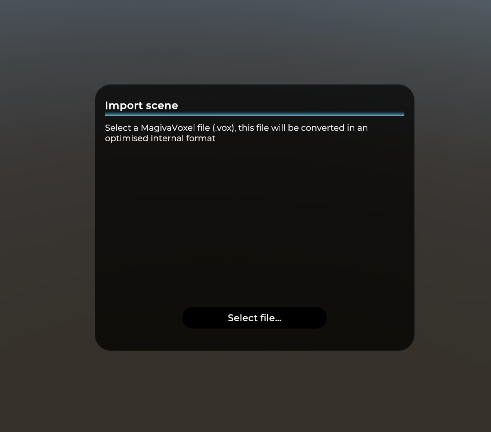
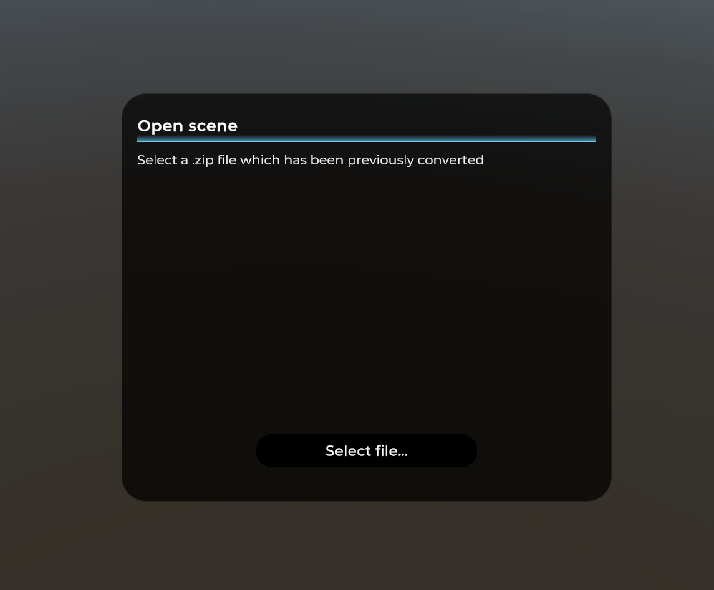

# VoxRTXHDRP

## Requirements

- Unity 2023.1.0b12+
- DirectX12
- HDRP

## What is VoxRTXHDRP ? 

VoxRTXHDRP allows you to import a MagicaVoxel project into Unity by using PathTracing. This project is a fork of my own project [VoxToVFX](https://github.com/Zarbuz/VoxToVFX)

## How to use it ? 

Like VoxToVFX, you need to convert your .vox file into the internal file format. Then you can open it wy selecting the .zip file which have been generated.

By default, the Pathtracing mode is not enable. To enable it, you need to press the key "T". To disable pathtracing, press "O" key. 

